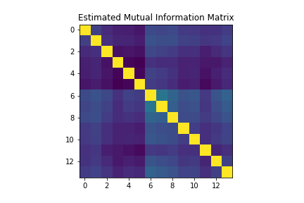
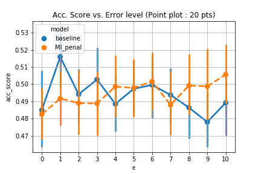

# Robust-Learning---Effects-of-Mutual-Information-Penalization
Robust learning algorithm from untrusted data ~ Konstantinov, N. and Lampert, (2019) https://arxiv.org/abs/1901.10310 served as great inspiration for this research project, although we intent to provide a different approach and focus on the robustness against the rate of noise in a binary classification case, using a mutual information penalization on the uniform divergence bound. 

# Abstract
In quantitative finance, sentiment analysis is perceived to be an interesting driver of market volatility that is afterwards used to sharpen pricing models for prediction. For this reason, several models are now built using more diversified type of data source and providers as inputs, which on the other side could significantly increase the sensitivity to the noise of the prediction to the noise.
Robust learning raised from the problematic that data we learn from can contain noise. The paper of ~ Niloka Konstantinov and Christoph H. Lambert (2019) ~ suggests an approach in order to tackle sentiment analysis as a binary classification problem in the situation of corrupted data sources. Indeed, they provide an algorithm that learns from the different data sources a weight attribution according to the quality of the data. In this paper, we intent to derive a similar algorithm that includes the correlation between the distribution of corrupted data sources.

# Motivation
The suggested model of ~ Nikola Konstantinov and Christoph Lampert (2019) ~ has a really interesting form. Indeed, the choice of the source-specific weights allocation in the model can be interpreted as finding a trade-off between minimizing the single discrepancies between the noisy distributions and the hypothetical reel distribution, and considering every source as identical on a learning perspective (normalized by the size of the training set).
To refer to the not intuitively related topic of Modern Portfolio Theory (MPT) in finance introduced by Henry Markowitz, this problem can be seen as a portfolio selection problem in which we want to maximize an expected return (which is in this case a minimization of the expected loss in a sense). However, unlike the min-variance portfolio optimization, the suggested model only captures divergence to the real distribution but not some "potential correlations" between the data sources.

How is this a potential improvement?
Let's assume we have two large noisy data sources which provide "closely related information" and weak "divergences" to reference data. According to the algorithm, the weights should be relatively higher for those two, although they are "strongly correlated" and provide the same information.

In the following paper we attempted to include this aspect in the weight allocation using Information Theory by measuring the divergence between distributions and derive an algorithm that should be robust to the correlated noise. As an application, we would like to see how this algorithm compare to the original at different level of noise.

# Mutual Information Score (from 14 corrupted data as a training set)

One observation of the noise generator leads to the above empirical mutual information matrix.

# Results
Finally, we iterated the process 20 times the process and we variated the level of noise from 0% (level : 0) to 100% (level : 10)

The suggested models seems to have a better resistance to the type of noise suggested in the experiments. Besides, it is also more robust to the similarity within the data sources. This would suggest that some interesting results can probably be derive using  generalized algorithm approach in this particular situation.
# Report paper
